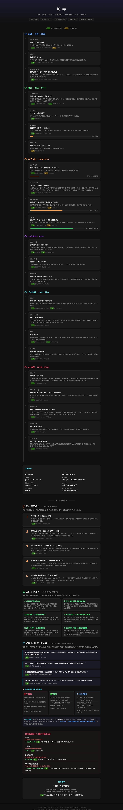
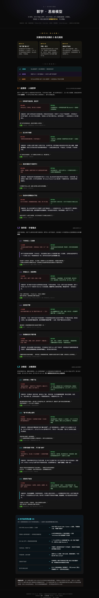

# 郭宇 · 第 01 号档案

> 1991 江西矿山小镇 → 2014 字节工号 #473 → 2020 年 28 岁退休 → 日本温泉 → 2025 AI 一人公司

🌐 **在线查看完整可视化档案**：[📊 人生路线图](https://qingshanliuci.github.io/100-young-fire/郭宇/人生路线图.html) · [🧠 思维模型](https://qingshanliuci.github.io/100-young-fire/郭宇/思维模型.html)

---

## 三个数字理解他

- **#473** — 2014 年加入字节跳动时的工号，全公司当时约 300 人。早期员工 vs 后期员工的期权差距通常 100 倍以上。
- **2013-04** — 通过 Hacker News 看到 BTC 突破 $100 后买入。至今未变现。
- **530+** — 退休后住过的日本温泉旅馆数量。

## 看哪份档案

### 📊 人生路线图 · 事实层

5 分钟扫完。6 个人生阶段时间线，每条事实带可信度色标（🟢 一手 / 🟡 二手），底部有 4 处交叉验证勘误（包括"出生地是江西不是湖南"等媒体误报修正）。

适合：**第一次了解他的人**。

🔗 [在线版（推荐）](https://qingshanliuci.github.io/100-young-fire/郭宇/人生路线图.html) · [HTML 源文件](人生路线图.html)

📸 点击展开预览图（长截图，约 800KB）

### 🧠 思维模型 · 抽象层

从 7 份材料中蒸馏出的"郭宇 OS"——3 条元规则 + 12 条原则，每条原则都用"默认做法 vs 郭宇做法"两栏对比验证过，附 AI 时代实操映射。

适合：**已经看过路线图，想从他身上拿到可迁移东西的人**。

🔗 [在线版（推荐）](https://qingshanliuci.github.io/100-young-fire/郭宇/思维模型.html) · [HTML 源文件](思维模型.html)

📸 点击展开预览图（长截图，约 850KB）

> ⚠️ 思维模型是**事后归纳**，不是郭宇本人写过的"OS 文档"。HTML 末尾有诚实标注的 caveat，区分哪些是他明说的、哪些是从行为推出的隐含规则。

## 资料来源

7 个维度的研究材料在 [资料/](资料/) 目录下：

| 维度 | 内容 |
|------|------|
| [01 人生自述](资料/01-人生自述.md) | 第一人称语录、博客、推特原文 |
| [02 访谈精华](资料/02-访谈精华.md) | 11 次媒体专访（2020-2026） |
| [03 日常动态](资料/03-日常动态.md) | Twitter @turingou 9400+ 推文 |
| [04 他人视角](资料/04-他人视角.md) | 朋友/媒体/国际通讯社的观察 |
| [05 关键决策链](资料/05-关键决策链.md) | 9 个人生重大节点的动机分析 |
| [06 财富时间线](资料/06-财富时间线.md) | 从 2008 到 2025 的财富积累节点 |
| [07 数字与证据](资料/07-数字与证据.md) | 可验证的硬事实（生日 / 工号 / GitHub） |

## 关键引语三则

> "学编程是因为当时没有其他路可以走……我无路可走。" — 36氪自述（2020），关于 17 岁开始的起点

> "以往我觉得财务自由就是绝对的自由，其实是一个错误的判断。" — PANews 专访（2025），34 岁回望

> "退休只是手段，找到有意义的事才是目的。不要被'财务自由'绑架，重要的是找到内驱力。" — B站「课代表立正」专访（2026-05），最新公开亮相

## 排除的来源

按本仓库[档案制作流程](../档案制作流程.md)：知乎、微信公众号、百度百科 — 全部不引用。
